 # Cajeros Automáicos

 ## Reto 

 Las interfaces de los cajeros automáticos son una de las interfaces tecnológicas que menos han evolucionado en los últimos 20 años. Incluso ahora que tenemos touch screens y muchas herramientas tecnológicas de diseño, muchos cajeros aún tienen pantallas negras o azules y tipografías de los años 80. Además de la mala interfaz, muchos cajeros tienen opciones muy confusas para los usuarios, convirtiendo esta experiencia en algo que muchos buscamos evitar. (Sumado a las variadas y modernas opciones de pago disponibles en la actualidad).

Elige un banco que tenga una mala experiencia en sus cajeros automáticos y haz tu propuesta de mejora a la experiencia. No olvides de tener en cuenta siempre al negocio.

## Desarrollado para 

[Laboratoria](http://talento.laboratoria.la/)
[Más información sobre el reto](https://github.com/Laboratoria/retos-placement/tree/master/retos-ux)

## Realizado por:

- Calderón Chumbes, María Alexandra

## Planificación de tiempos

[Planificación de tiempos - Trello App](https://trello.com/b/Dpil7uIH/reto-cajeros-autom%C3%A1ticos)

## **RESEARCH**

## Formularios

Se creó un formulario para saber cuáles eran las dificultades de la mayoría de usuarios al usar un cajero automático. También se pudo encontrar cuáles eran los bancos que tenían estas fallas en la expriencia, las edades, la afinidad y decisión de ir a cajero o ventanilla, si preferían la modalidad táctil o los botones, entre otros datos importantes.

- Herramienta: Google Forms

[Formulario](https://goo.gl/forms/Hr8ENVMMwYRltpi13)

### Guía de entrevista a los usuarios.

Esta entrevista se realizó inmediatamente después de que el usuario hubiese tenido una experiencia en el cajero.

Preguntas guía:

- ¿Cómo te sentiste usando el cajero?
- ¿Lograste terminar tu operación?
- ¿Qué harías para mejorar la experiencia en el cajero?

### Entrevistas - pruebas realizadas

1. **Entrevista Angela García**

Edad: 21 años
Ocupación: Estudiante de Psicología

- Angela quiso sacar 15 soles de un cajero automático y no pudo, pues este solo cuenta con billetes a partir de 20 soles. No completó la operación pero sacó un voucher con el registro de movimientos.

[Angela](https://drive.google.com/open?id=1cIYBC_APnwVgFrqA0TXE_nQT6STrAdH2)

2. **Entrevista Jennifer Martinez**

Edad: 19 años
Ocupación: Estudiante de Medicina

- Jennifer sacó 20 soles de su cuenta en un cajero, lo hizo con éxito, pero aún siente que tiene que esperar mucho tiempo para tener el dinero en sus manos.

[Jennifer](https://docs.google.com/presentation/d/1dSuGN-A3hd0djoG3d74doMmSCXUFutPqpNWY789_pj4/edit?usp=sharing)

## Formularios Online:

### **Conclusiones de la encuesta online**

- El 46.3% usa BBVA y el 53.6% usa BCP.
- La mayoría de personas quisiera poder sacar ontos pequeños como 5 o 10 soles.
- Más personas prefieren un cajero automático táctil.
- Para los usuarios es de mucha importancia que las operaciones sean más rápidas.
- Quieren usar el cajero automático sin necesidad de una tarjeta o solo con uso biométrico.
- Monedas y billetes en un mismo cajero.
- La mayoría de personas se siente medianamente segura con su tarjeta en el bolsillo.
- La mayoría de personas cree que usar un cajero es fácil. 

### Gráficos de los resultados de la encuesta

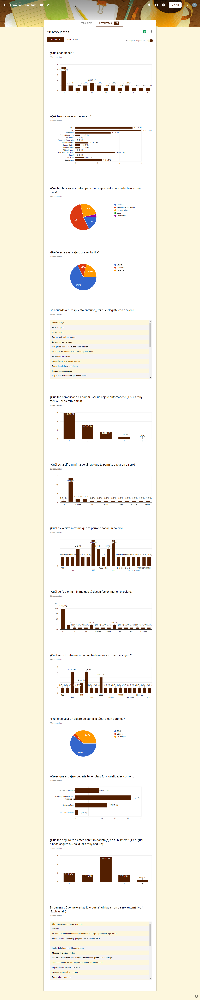
[PDF Gráficos](https://drive.google.com/drive/folders/1LAeKcdryVaXy7mTqTCDyAHT3ECFWQILs?usp=sharing)

## **Benchmarck**

##**ANÁLISIS DE DATOS**

## **Problem Statements**

En el proceso de investigación, encontramos el punto de mejora: hacer que las operaciones sean más rápidas, en especial los retiros. 

- Se escogió el BBVA Banco Continental porque es uno de los banco que más uso tiene.

## Flujo de una operación actual del banco:

[Flujo de Retiros de dinero BBVA](https://www.bbvacontinental.pe/personas/canales/cajeros-automaticos/#ficha-content-2)
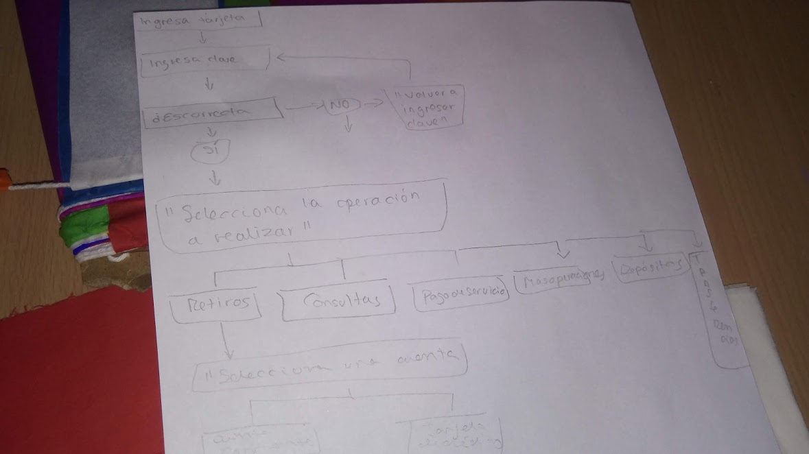
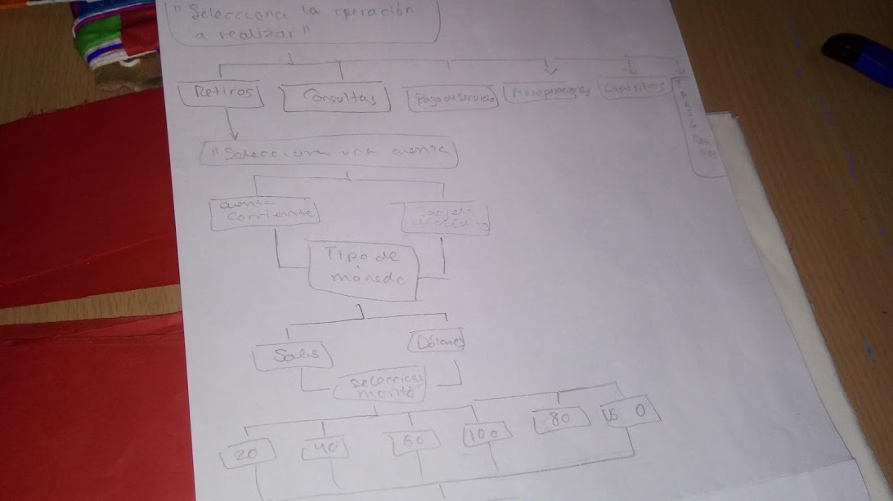
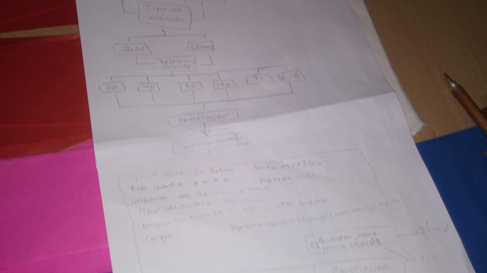
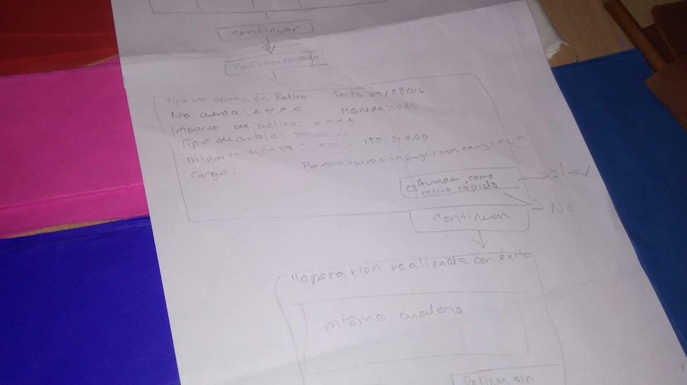
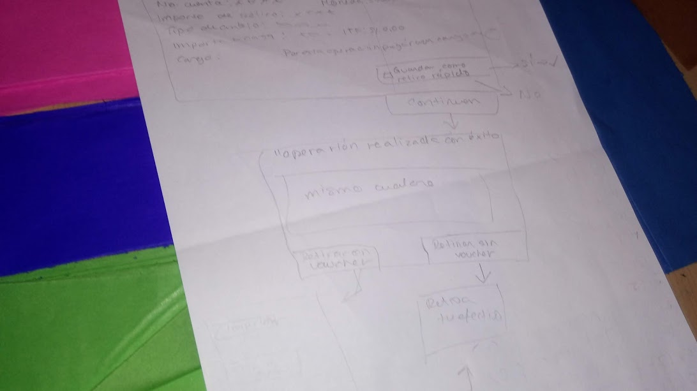
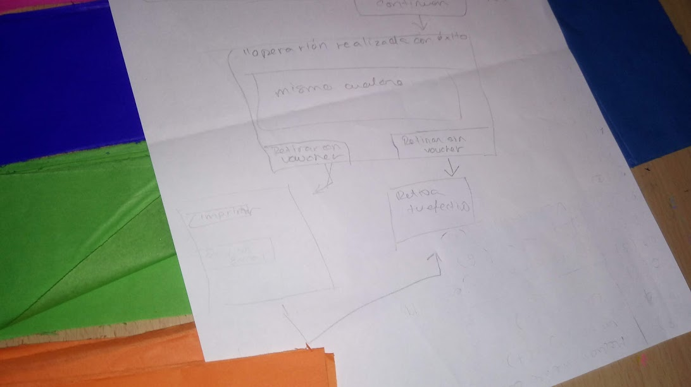

## **HMW**

- ¿Cómo podríamos brindar un mejor servicio en menos tiempo?
- ¿Cómo podríamos generar un sistema con menos pasos?
- ¿Cómo podríamos implementar montos?
- ¿Cómo podríamos mostrar un flujo de manera sencilla y directa?

## **PROPUESTA DE PRODUCTO**

Nuestra propuesta es un nuevo sistema para cajeros táctiles. Este sistema tendrá menos pasos a seguir antes de completar una operación.

## **User persona y Storytelling**

- Carlos García
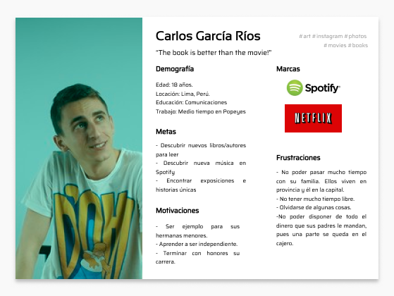

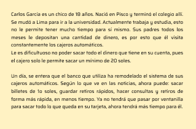

- Hellen Chumbes

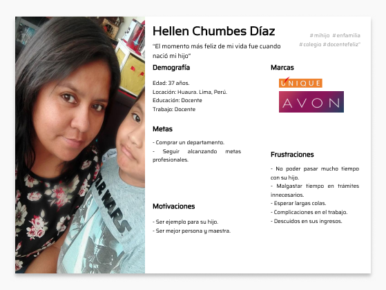

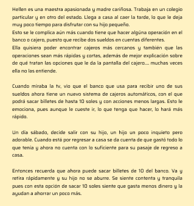

## **IDEACIÓN**

### Lista de ideas

### Priorización

### Feature List

## User flow

[User Flow](https://docs.google.com/presentation/d/1KSLhnJD7F85ECQSR1zEHPnqywCaOtG3UM9KNIhhWYzw/edit?usp=sharing)

## BUSINESS MODEL CANVAS

## Paper prototyping 

### Todos los flujos

### Bienvenida

### Registro

### Ingresar destino y trazar ruta

### Servicios y atractivos que se encuentran en la ruta

### Rutas guardadas

### Grabar ruta

### Galería de fotos

### Alertas

### Descarga de rutas

## ITERACIÓN

## Testing del Paper prototyping

### Modificaciones y puntos de mejora

- Hacer el registro más entendible, poner usuario y contraseña primero, luego los botones de Gmail y Facebook.
- Hacer la bienvenidad un poco más llamativa.

## **Primer prototipo de Alta fidelidad**

[Outdoor](https://marvelapp.com/65di1jd/screen/40514833)

## Modelo del producto

## SEGUNDA ITERACIÓN

## Testing del prototipo de alta fidelidad.

- Mejorar la legibilidad de algunos íconos.
- Información sobre el medio de pago de los servicios.
- Detallar funcionalidades nuevas.
- Hacer slider las vistas de bienvenida.
- Modificar el flujo de Galería y edición de imágenes.
- Resaltar la funcionalidad de grabación de rutas.

### Modificaciones y puntos de mejora

- Corrección de los íconos elegidos.
- Detalle de color cuando la ruta está siendo grabada.
- Corrección de enlaces rotos. 
- Brindar una guía al usuario en algunas funcionalidades. 
- Flujo de edición de fotografías más práctico y entendible.
- Agregado "Comunícate con nosotros" en el menú hamburguesa.
- Agregado de cámara en el mapa.

## Propuesta final.

[Mejora de experiencia cajeros BBVA](https://marvelapp.com/38e0e9j/screen/44386899)

## Implemetaciones a futuro

- Reporte del clima de acuerdo a la ruta elegida. 
- Planificación de actividades.
- Filtro en edición de fotografías.
- Sistema de offline.
- Seguimiento en vivo.

## Presentación del producto

[Presentación Cajeros Automáticos BBVA]()

## HERRAMIENTAS UTILIZADAS

- Testing
- Customer Journey Map
- Figma
- Marvel
- Google Drive
- Google Form
- Design Thinking

